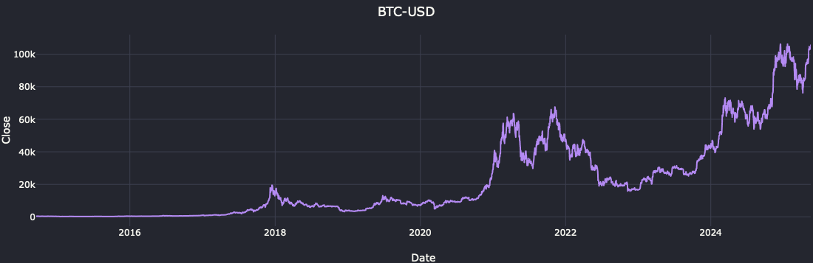
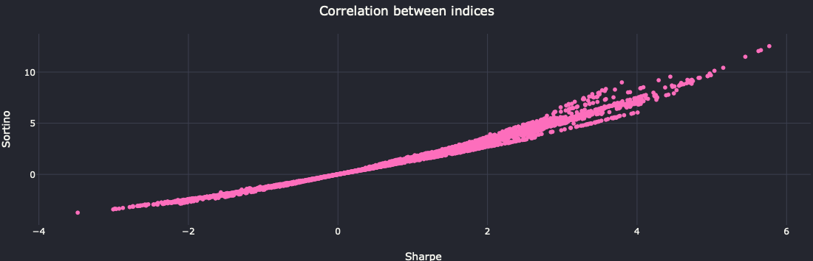
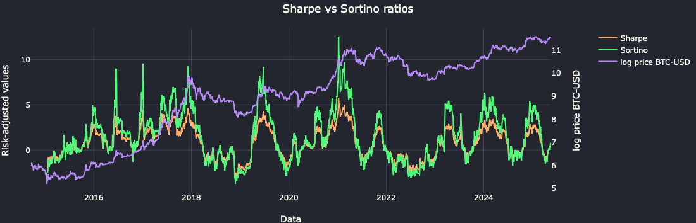

# Sharpe vs Sortino W/ Bitcoin 
Before selecting a financial asset, investors should look for risk-adjusted returns, not just simple returns </br>
This project compares the performance of the Sharpe and Sortino ratios using Bitcoin data, demonstrating their differences under different market conditions

</br>

## About Data
- Bitcoin (BTCUSD) historical data (2014~2025) using YFinance



</br>

## About Metrics

$$
\Huge
\textbf{Sharpe ratio} = \frac{\text{return of portfolio (or stock)} - \text{risk-free rate}}{\text{standard deviation of returns}}
$$

- Sharpe ratio indicates how well an investment performs compared to a risk-free investment, taking into account the additional level of risk involved in holding the stock investment
---

$$
\Huge
\textbf{Sortino ratio} = \frac{\text{return of portfolio (or stock)} - \text{risk-free rate}}{\text{standard deviation of the negative returns}}
$$

- Sortino ratio is a variation of the Sharpe ratio that considers only downside risk

</br>

## Data Preparation
- Calculating Sharpe and Sortino Ratio using QuantStats

</br>

## Modeling
- Applying logarithmic transformation to Bitcoin prices
- Calculating Sharpe and Sortino Ratio in rolling intervals

</br>

## Evaluation
### Correlation


- Correlation `r=0.988` showing that there is a linearity in the relationship between the two variables
- P-value `p=0.000` proving that there is a very high statistical significance

</br>

### Sharpe vs Sortino ratios


- Logarithmic transformation is useful for smoothing out extreme percentage changes, making it easier to see long-term trends and reducing distortion caused by outliers. In the chart, prices on a logarithmic scale show a more linear decline, which helps to interpret compound returns
- "Sharpe" effectively penalizes all volatility (positive and negative), which can undervalue strategies in volatile assets like Bitcoin, where positive swings are frequent. It is more common in traditional portfolios (stocks, fixed income)
- "Sortino" focuses only on downside risk (negative volatility), being more suitable for assets with high asymmetric volatility (such as Bitcoin) or strategies that seek to maximize gains in "bull markets"
- "Sortino" is not exclusive to "bull markets", but rather to any context where positive volatility is not a risk (hedge funds, cryptocurrencies)
- “Sharpe” uses the total standard deviation in the denominator, which can distort the assessment if positive returns are too dispersed. For Bitcoin, where large gains are common, this can lead to an artificially low ratio even if the strategy is profitable
- "Sortino" is more focused on relevant risk (losses), which makes it preferable for investors averse to sudden drops
- However, "better vision" depends on the objective:
  - If the concern is to avoid losses (conservative funds), "Sortino" is ideal
  - If total volatility is critical (leverage), "Sharpe" still has value

</br>

## Deployment
- Show results in a Jupyter notebook

</br>

## How to Run
```bash
git clone https://github.com/pmusachio/sharpe-sortino-bitcoin.git

cd enterYourDownloadPath/sharpe-sortino-bitcoin

python -m venv venv
source venv/bin/activate

pip install -r requirements.txt
```

</br>

## Get in touch
[](mailto:paulomusachio@gmail.com) </br>
[](https://www.linkedin.com/in/pmusachio/)
